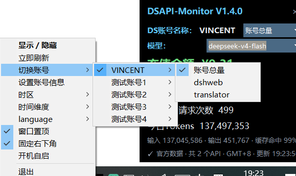
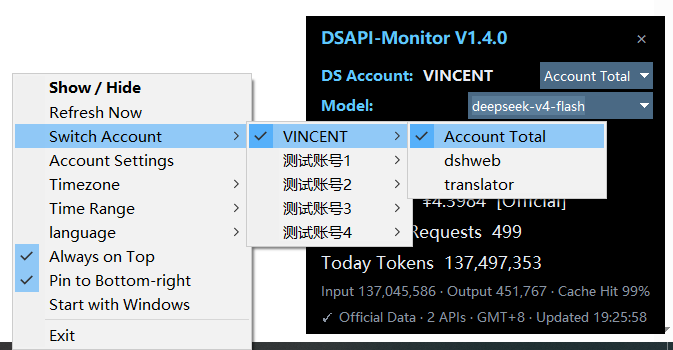
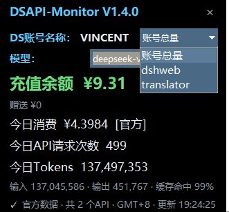
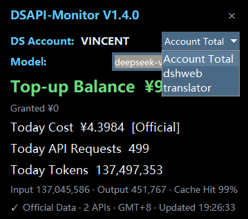
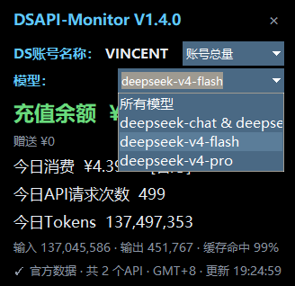
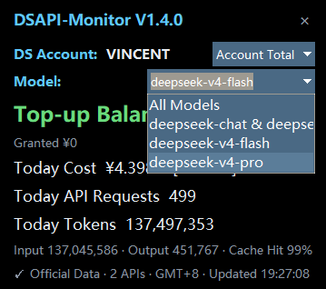

  

<h1 align="center">DSAPI-Monitor</h1>

  轻量级 Windows DeepSeek API 用量监控工具 
  A lightweight DeepSeek API usage monitor for Windows

  <a href="../../releases/latest"><strong>下载最新版本 / Download Latest Release</strong></a>

---

## 中文

DSAPI-Monitor 是一款轻量级 Windows 桌面工具，支持独立查看多个 DeepSeek 账号和多组 API Key 的余额及用量情况。

### 主要功能

- 管理多个 DeepSeek 账号和多组 API Key
- 显示余额、消费金额、API 请求次数和 Token 用量
- 支持今日、昨日、近 7 天、近 30 天、本月和上月
- 支持账号总量、独立 API Key 和具体模型筛选
- 自动从平台响应中获取模型列表
- 支持中文与 English 界面切换
- 支持系统托盘、定时刷新、窗口置顶和固定右下角
- 可选开机自启
- 使用 Windows DPAPI 加密保存 API Key 和 userToken

### 运作原理

软件使用 API Key 调用 DeepSeek 官方余额接口：

`GET https://api.deepseek.com/user/balance`

配置可选的 DeepSeek 平台 `userToken` 后，软件还会访问官网用量页面使用的内部接口，获取消费、请求次数、Token 和模型明细。

数据在本地完成分组、去重和汇总，再根据所选账号、API Key、模型及时间范围显示。软件不会将用户凭证上传或共享给其他服务。

---

## 界面预览 / Screenshots

### 切换账号 / Switch Accounts

通过系统托盘快速切换不同的 DeepSeek 账号和 API Key。  
Quickly switch between DeepSeek accounts and API keys from the system tray.

<table>
  <tr>
    <th>中文界面</th>
    <th>English UI</th>
  </tr>
  <tr>
    <td></td>
    <td></td>
  </tr>
</table>

### 账号总量与独立 Key / Account Total and Individual Keys

查看整个账号的总用量，或者单独查看某一把 API Key 的用量。  
View total account usage or usage for an individual API key.

<table>
  <tr>
    <th>中文界面</th>
    <th>English UI</th>
  </tr>
  <tr>
    <td></td>
    <td></td>
  </tr>
</table>

### 模型筛选 / Model Filtering

模型列表从平台响应中自动获取，可切换查看不同模型的用量。  
Models are discovered automatically from platform responses and can be filtered individually.

<table>
  <tr>
    <th>中文界面</th>
    <th>English UI</th>
  </tr>
  <tr>
    <td></td>
    <td></td>
  </tr>
</table>

### 使用方法

1. 从 [Releases](../../releases/latest) 下载并运行 `DSAPI-Monitor.exe`。
2. 添加 DeepSeek 账号名称和 API Key。
3. 如需详细历史用量和模型数据，可选填平台 `userToken`。

> 详细用量依赖 DeepSeek 网页平台的内部接口，可能随官方网站更新而变化。未签名的 EXE 可能触发 Windows SmartScreen“未知发布者”提示。

---

## English

DSAPI-Monitor is a lightweight Windows desktop tool that provides separate usage views for multiple DeepSeek accounts and API keys.

### Features

- Multiple DeepSeek accounts and API keys
- Account balance, spending, API requests, and token usage
- Today, Yesterday, Last 7 Days, Last 30 Days, This Month, and Last Month views
- Account-level, individual API key, and model-based filtering
- Automatic model discovery from platform responses
- Chinese and English interfaces
- System tray integration and automatic refresh
- Always-on-top mode and bottom-right pinning
- Optional Start with Windows
- Windows DPAPI encryption for API keys and userTokens

### How It Works

The application retrieves account balances through DeepSeek's official endpoint:

`GET https://api.deepseek.com/user/balance`

When an optional DeepSeek platform `userToken` is configured, the application also accesses the internal endpoints used by the official usage webpage to retrieve spending, request counts, token usage, and model details.

All data is grouped, deduplicated, and aggregated locally before being displayed according to the selected account, API key, model, and time range. User credentials are never uploaded or shared with other services.

### Getting Started

1. Download `DSAPI-Monitor.exe` from [Releases](../../releases/latest).
2. Add your DeepSeek account name and API key.
3. Optionally provide a platform `userToken` for detailed historical and model usage.

> Detailed usage data relies on internal DeepSeek web-platform endpoints and may be affected by future website changes. Since the executable is not code-signed, Windows SmartScreen may display an “Unknown publisher” warning.

